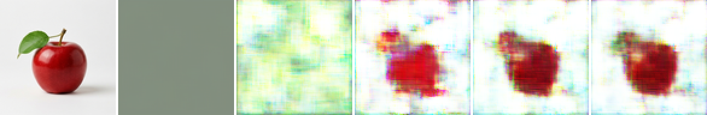
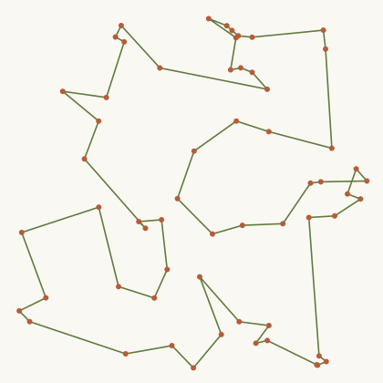
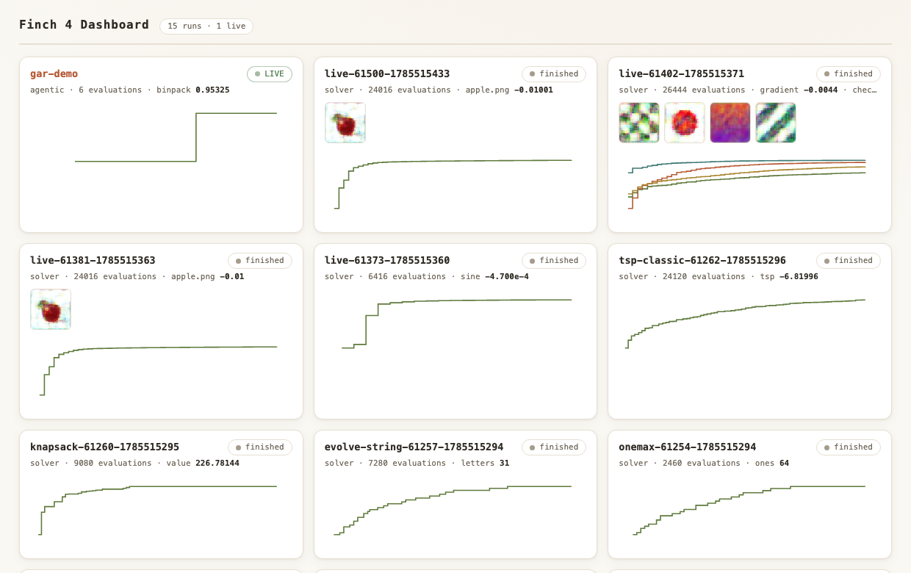
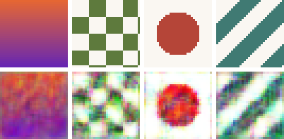
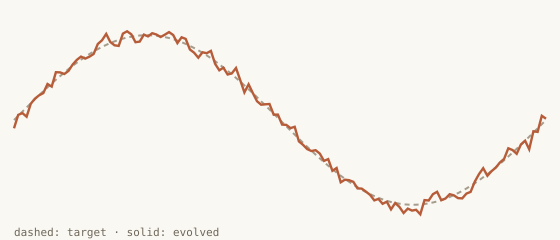

# Finch 4

Finch 4 is the latest iteration of [Finch](https://github.com/dadukhankevin/Finch/tree/finch-3), combining Finch's modularity with concepts from genespace, [latentspace](https://github.com/dadukhankevin/latentspace), and [SCRISPR](https://github.com/dadukhankevin/SCRISPR).
The result is a library capable of very general evolution. For example, using latent decoders we can solve many kinds of problems with just one algorithm:

```python
import finch4

def fitness(phenotypes):   # batched: tensor in, one score per row
    return -((phenotypes - target) ** 2).flatten(1).mean(dim=1)

result = finch4.solve(fitness, output_shape=(32, 32, 3), epochs=1_500)
result.best_phenotype
```

Provided a fitness function and an output shape, the algorithm can solve any optimizable problem.



That strip is `examples/decoders/evolve_image.py` running on a photo of an apple: the target on the left, then the best individual at a few points during the run. The fitness function is plain pixel error; everything else is the shared decoder and evolution (24k evaluations, about 15 seconds on an M-series Mac).

Sometimes you might still want a traditional GA. Finch lets you (or your agent) write one in a higher-level way than any other available library.

```python
from finch4 import (Environment, Populate, Breed, Mutate, Evaluate,
                    SortByFitness, CapPopulation, order_crossover,
                    inversion)

env = Environment([
    Populate(random_tour, 120),
    Breed(order_crossover, children=80),
    Mutate(inversion, rate=0.6),
    Evaluate(lambda tour: -tour_length(tour)),
    SortByFitness(),
    CapPopulation(120),
], seed=0)
env.evolve(generations=300)
env.best_ever
```

(That one is the 60-city traveling salesman demo in `benchmarks/finch_tsp_demo.py`: it took about 24k evaluations in 1.4 seconds and was 12% better than nearest-neighbor algo.)



The tour drawing comes from `examples/classics/tsp.py`, which also posts it to the dashboard while it runs.

A new method called genetic auto-research is also available within Finch 4. Using the same methodology as the universal algorithm in the first example, we replace latent decoders with research agents whose ideas can mutate, combine, and evolve. This is similar to Karpathy's auto-research except it's cooler since it's a genetic algorithm. It's based on prior work I made called [SCRISPR](https://github.com/dadukhankevin/SCRISPR), but genetic auto-research is the best iteration of the idea. In my first comparison, GAR (genetic auto-research) beat normal auto-research, but I will study more.

```bash
python3 -m finch4.drive --run benchmarks/agentic/runs/r2 \
    --tasks binpack tsp --tasks-dir benchmarks/agentic/tasks \
    --agent-cmd 'claude -p "$(cat {promptfile})"' --rounds 6
```

A small live GAR run (`examples/gar/binpack.sh` is the command version): two founder agents and four mutations on the bin packing task. The plain best-fit rule scores 0.9417; the run's champion reached 0.9533 on the practice seeds and 0.9371 on the held-out seeds, and one consolidation absorbed the winning structure into the shared playbook while leaving its tuned constants out.

Two skills in `.claude/skills/` make agents work well with Finch 4: one is for operating inside a running GA, and the other is for authoring brand new evolutionary problems. Make sure your agents install both skills!

Agents can mix and match all of the above strategies, and all evolution is reported to one live dashboard:

```bash
python3 -m finch4.hub        # http://127.0.0.1:8800
```

All runs join the dashboard by passing `progress=finch4.live_progress()` to solve(). If what you are evolving is an image, the dashboard shows it evolving live, no extra code. Anything else (an SVG of the best tour, a snippet of the champion's code) should be posted with `progress.report_media(...)`. I'm actively working on improving the dashboard.



Finch 4 scales from traditional GAs that are simply easier to write than in any other library, to algorithms that differentiate between phenotype and genotype. What this means is that the latent decoders see a universal genetic code of 1s and 0s, and learn to decode the genetic signature of various individuals into any given output shape. Then we perform evolution over the inputs, the genetic code, which universalizes the GA to work on nearly every problem one could imagine without needing much further optimization.

When we place agents as the decoder inside genetic auto-research, the 'genespace' is text rather than 1s and 0s, but because this is all on a computer it's really nearly the same either way (the binary genetic code is just obfuscated from us humans!). The differentiation between genotype (genetic code) and phenotype (produced individual) is the key to advanced evolution in both scenarios.

## More examples

Everything in `examples/` runs on its own and reports to the dashboard.

Classics (`examples/classics/`): `onemax.py`, `evolve_string.py`, `knapsack.py`, and `tsp.py`. Same layer grammar as the TSP snippet above; each one defines its operators as plain functions.

Decoders (`examples/decoders/`): `evolve_image.py` (point it at any photo), `sine.py` (curve fitting), and `species.py`, which evolves four different images in one population. Fitness shares give each target an equal slice of the fitness mass, so no target can be outcompeted out of existence, and the shared decoder periodically distills each species' best discovery into its base:





Genetic auto-research (`examples/gar/`): `binpack.sh`, the unattended version of the GAR run described above.

Install:

```bash
pip install -e .
```

The research record behind every shipped default lives in the [latentspace repo](https://github.com/dadukhankevin/latentspace). Finch 3 remains available at the [finch-3 tag](https://github.com/dadukhankevin/Finch/releases/tag/finch-3).

This project is the result of 6 years of research into genetic algorithms, and building better ones. I used many previous libraries I worked on to combine everything into Finch 4 and countless hours talking and collaborating with Claude and testing every possible idea to get to the dream of a universal genetic algorithm. Research notes and reports of these conversations can be found at https://loseylabs.ai. All of the notes are written by Claude but contain interesting information and show how researching alongside Claude goes, whose ideas work in what circumstances, and why it's important to trust your gut as a human, ask good questions, and follow your curiosity. 
