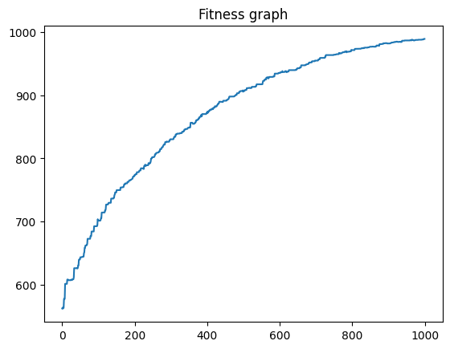

# Floats

In this example, we will evolve a set of individuals. Each individual will contain a long list of floats. Our goal is to simply evolve our individuals such that the sum of their values achieves higher and higher results.&#x20;

### Import Finch:

```python
from Finch.environments import Sequential
from Finch.genepools import FloatPool
from Finch.layers import *
import numpy as np
```

### Define a Fitness Function:

This function determines how "fit" any given individual is. The higher the sum of its genes, the more fit it its, and the more likely to pass on its genes and live.

```python
def fit(individual):
    return np.sum(individual.genes)
```

### Configure helpful variables.

<pre class="language-python"><code class="lang-python"># Information for our GenePool
length = 100 # each individual.genes array will have 100 items
pool_minimum = 0
pool_maximum = 10
<strong># environment variables
</strong>population_size = 100
evolution_steps = 1000
max_population = 99
# parenting/crossover
parent_count = 20
children_count = 2
# mutation
amount_to_mutate = 10
gene_selection = 5
min_mutation = -2
max_mutation = 2
</code></pre>

### Create a FloatPool:

Here, our `GenePool` is a `FloatPool`, which simply means it is meant to generate individuals containing large amounts of floats.

* length = amount of genes to give each individual
* minimum = minimum value any gene can be given initially
* maximum = maximum value any...

```python
pool = FloatPool(length=length, minimum=pool_minimum, maximum=pool_maximum)
```

### Create an Environment:

Since we are creating a pretty simple genetic algorithm, the only `Environment` we need to use is the simple `Sequential` environment. This allows us to put the basic elements of our genetic algorithm together using layers:

* `Populate` Generates individuals for the environment until the `population_size` is met.
* `FloatMutateRange` Mutates several individuals, changing some of their genes by adding or subtracting any number between `minimum` and `maximum`.&#x20;
* `SortByFitness` Sorts our individuals.
* `CapPopulation` Using the sorting in the previous layer, removes the worst individuals and keeps the best.

```python
environment = Sequential(layers=[
    Populate(pool, population=population_size),
    FloatMutateRange(individual_selection=amount_to_mutate, gene_selection=gene_selection,
                     min_mutation=min_mutation, max_mutation=max_mutation, 
                     keep_within_genepool_bounds=True),
    ParentSimple(parent_count, children=children_count),
    SortByFitness(),
    CapPopulation(max_population=max_population),
])
```


### Evolve our Individuals:

Now we can compile and run our environment!

```python
environment.compile(fitness_function=fit)
environment.evolve(evolution_steps)
print("Here is the best individual:\n", environment.best_ever.genes)
```


### View Environment History:

Lastly, let's plot the history of the fitness of our best individuals from each generation:

`environment.plot()`

<figure><figcaption></figcaption></figure>

**If you want a Google Colab, here it is!**&#x20;

[**Colab Link**](https://colab.research.google.com/drive/1QK7zYTBSkud4V6QQQRCi0ofkJ9bFp9B9?usp=sharing)\
